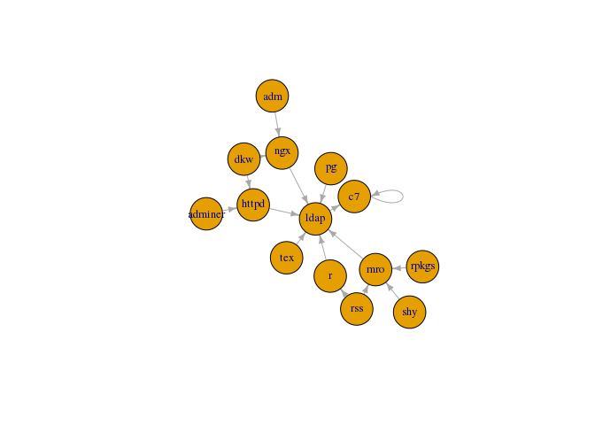

dockerfiles
===========

~~Pretty much~~ the entire SDAL infrastructure stack.

This repository uses git submodules.  All the directories in the `active` and `inactive` folders are submodules in this repository.
You can choose to use this repository just for the compose files if you'd like and not have to deal with the git-mastics of working with submodules.
The submodule setup is really here as a convenience so you don't need to clone all the repositories separately.

Non-submodule useage
====================

If you plan to not use submodules, remember to do a separate git clone for all the other image repositories.

### First time cloning

- `clone` this repository as usual
```bash
git clone git@github.com:bi-sdal/dockerimages.git
```
- The directories in the `active` and `inactive` directores will be empty, this is normal.
You can use the docker compose files with
```bash
docker compose up -d --no-recreate
```
### Making Changes

Making changes is the same as a normal git repository with the `git add` and `git commit` commands.

<hr>

Submodule Basic useage
======================

Commonly used functions

### First time cloning and getting this repository

```bash
git clone --recursive git@github.com:bi-sdal/dockerimages.git
```

### Updating everything before making more changes
```bash
git pull --recurse-submodules=yes origin master && \
git submodule update --remote --merge
```
### Making changes to the repository (not the submodules)

-   Make edits like before
-   `git add`
-   `git commit -m ''`
-   `git push origin master`

### Making changes to one of the submodules

-   make change to individual submodule
    -   `cd` into the submodule
    -   `git checkout master`
    -   make yo changes
    -   `git add` / `git commit` like a normal repository
    -   `cd ..` back to the root repository
-   update submodule references
    -   `git add` submodule
    -   `git commit -m 'update submodule references'`
    -   `git push --recurse-submodules=on-demand origin master`

### Add a new submodule

-   `git submodule add <GIT URL>`
-   `git submodule update --remote`

### Pulling down a new submodule created elsewhere

    git submodule init && \
    git submodule update --remote

### Move submodule into another directory

```bash
git mv submodule_folder new_submodule_folder
git status
git commit -m 'move submodules'
```

### Dealing with moved submodules

You might end up with this `status` message after modules are moved

```bash
$ git status
On branch master
Your branch is up-to-date with 'origin/master'.
Untracked files:
  (use "git add <file>..." to include in what will be committed)

	adminer-httpd-ldap-ssh-c7/
	c7/
	dkw-httpd-ldap-ssh-c7/
	dpl7/
	httpd-ldap-ssh-c7/
	ldap-ssh-c7/
	mro-ldap-ssh-c7/
	pg-ldap-ssh-c7/
	rpkgs-mro-ldap-ssh-c7/
	rss-mro-ldap-ssh-c7/
	shy-mro-ldap-ssh-c7/

nothing added to commit but untracked files present (use "git add" to track)
```

To resolve this, you just need to remove the folders listed in untracked files.
You can do this with oneline using:

```bash
git ls-files --others --exclude-standard | xargs rm -rf
```
<hr>

What's in here?
===============

scripts and stuff for the docker containers

-   `install.R`: Script to install packages (used by docker containers)
-   `docker-compose.yml`: `docker-compose up -d` to spin up all the containers
-   `build.sh`: script to built the containers properly, call this script from within one of the submodule folders `../build.sh`
-   `gettin_docker_running_centos_7`: ???

This repository uses `git submodules`

Note: `docker-compose` uses the folder it is in as a prefix for container names. Caused an error with the networking. So the `dockerimages` repository name is really important here.

<hr>

Older commands and instructions
===============================

-   `clone` this repository and pull down the submodules:
```bash
git clone git@github.com:bi-sdal/dockerimages.git
cd dockerimages
git submodule init && git submodule update
```

Getting (fetch/merge) all changes in submodles
----------------------------------------------

assumes you want to update the checkout to the `master` branch

`git submodule update --remote --merge`

Getting the `diff` by showing submodule log
-------------------------------------------

`git diff --submodule`

Update everything
-----------------

`git submodule foreach git pull origin master`

AHHH!!! Just bring me to master (discard all changes)
-----------------------------------------------------

``` bash
git submodule foreach git checkout master && \
git submodule foreach git pull origin master && \
git pull origin master
```

Pushing and Pulling
-------------------

-   `git pull --recurse-submodules=yes origin master`
-   `git push --recurse-submodules=on-demand origin master`

### Deployed images

| Container                     | Status                                                                                                                                                |
|-------------------------------|-------------------------------------------------------------------------------------------------------------------------------------------------------|
| **mro**-ldap-ssh-c7           | [](https://travis-ci.org/bi-sdal/mro-ldap-ssh-c7)                     |
| **mro3.3.3**-ldap-ssh-c7      | [](https://travis-ci.org/bi-sdal/mro3.3.3-ldap-ssh-c7)           |
| **pg**-ldap-ssh-c7            | [](https://travis-ci.org/bi-sdal/pg-ldap-ssh-c7)                       |
| **rss**-mro-ldap-ssh-c7       | [](https://travis-ci.org/bi-sdal/rss-mro-ldap-ssh-c7)             |
| **adm-ngx**-ldap-ssh-c7       | [](https://travis-ci.org/bi-sdal/adm-ngx-ldap-ssh-c7)             |
| **adminer-httpd**-ldap-ssh-c7 | [](https://travis-ci.org/bi-sdal/adminer-httpd-ldap-ssh-c7) |
| **dkw-httpd**-ldap-ssh-c7     | [](https://travis-ci.org/bi-sdal/dkw-httpd-ldap-ssh-c7)         |
| **dkw-ngx**-ldap-ssh-c7       | [](https://travis-ci.org/bi-sdal/dkw-ngx-ldap-ssh-c7)             |

### Base images

| Container             | Status                                                                                                                                |
|-----------------------|---------------------------------------------------------------------------------------------------------------------------------------|
| **c7**                | [](https://travis-ci.org/bi-sdal/c7)                               |
| **ldap**-ssh-c7       | [](https://travis-ci.org/bi-sdal/ldap-ssh-c7)             |
| **ngx**-ldap-ssh-c7   | [](https://travis-ci.org/bi-sdal/ngx-ldap-ssh-c7)     |
| **httpd**-ldap-ssh-c7 | [](https://travis-ci.org/bi-sdal/httpd-ldap-ssh-c7) |


